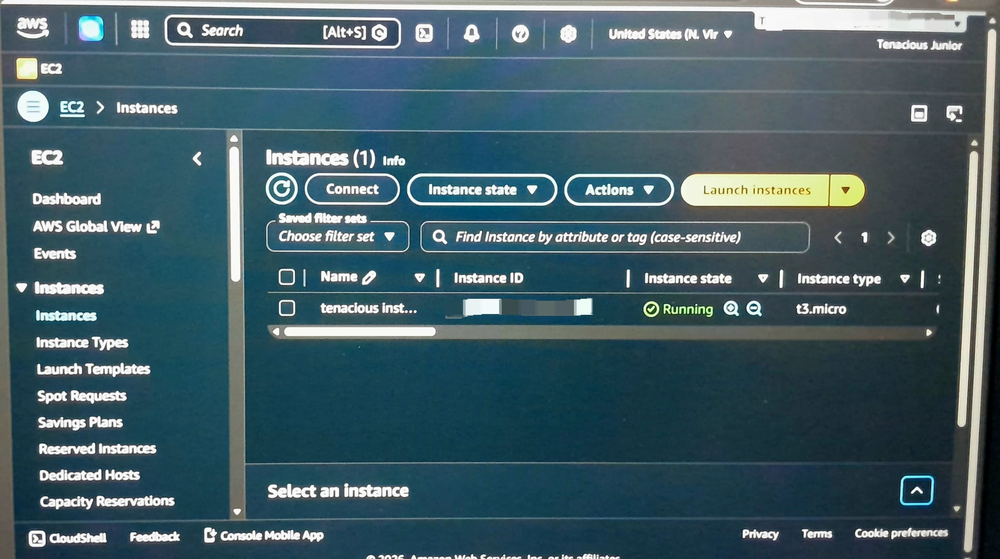

# aws-first-ec2
First AWS EC2 Launch from Accra , free tier+ security -first.
# First AWS EC2 Launch - Apr 22, 2026
   
   Launched from Accra, Ghana.
   
   **Instance**: tenacious instance  
   **Type**: t3.micro - Amazon Linux 2023  
   **Region**: us-east-1  
   **Status**: Deployed, tested, stopped to maintain free tier  
   
      
   
   **Skills**: AWS EC2, Free Tier management, Security redaction
   
   Next: Automating AWS with Python + boto3
